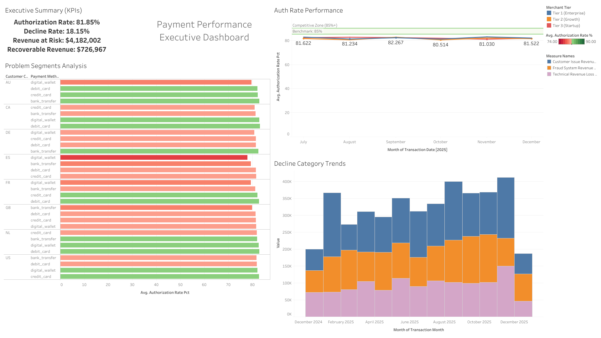
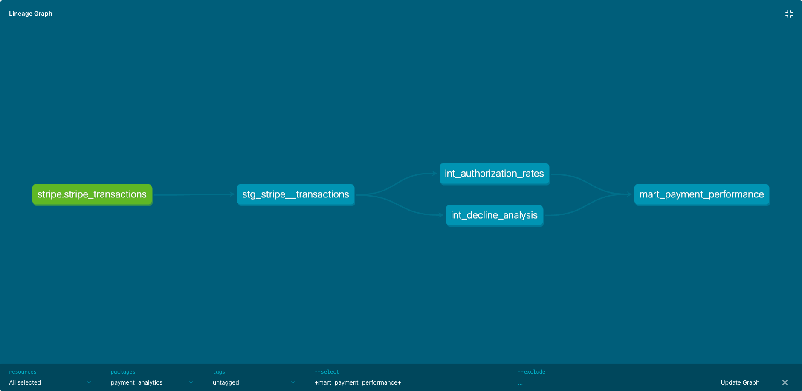
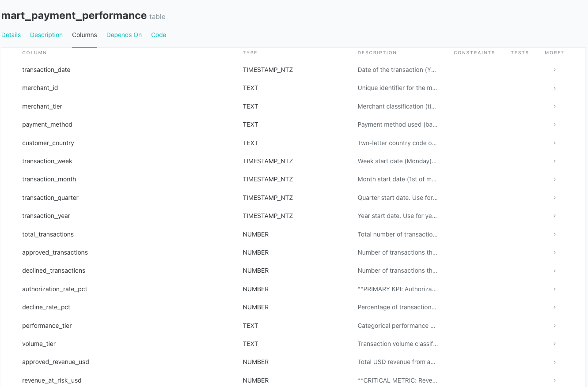

# 💳 Payment Analytics Stack - Checkout.com Case Study

**Project Type:** End-to-end payment performance analytics infrastructure
**Stack:** Snowflake + dbt Core + Tableau Public
**Status:** ✅ Production-ready

---

## 🎯 Project Summary

This project demonstrates a production-ready payment analytics infrastructure built using modern data engineering best practices. It showcases the complete lifecycle from raw transaction data to executive-ready dashboards and actionable business insights.

**Key Deliverables:**
- ✅ Live interactive Tableau dashboard ([View Dashboard](https://public.tableau.com/app/profile/tyler.mclaurin/viz/Checkout-Analytics/Dashboard1))
- ✅ Medallion architecture with 4 dbt models (staging → intermediate → marts)
- ✅ 13 automated data quality tests (100% passing)
- ✅ Full documentation with DAG lineage and column-level descriptions
- ✅ $727K revenue recovery opportunity identified through data analysis

**Business Impact:**
Identified a 4-percentage-point authorization rate gap (81.85% actual vs 85% industry benchmark), representing $727K in recoverable revenue through fraud system optimization and country-specific payment method tuning.

**Technical Highlights:**
- 150K synthetic Stripe transactions (1 year of data)
- Comprehensive dbt testing and documentation
- Industry-standard payment metrics implementation
- Self-service BI dashboard for stakeholder enablement

---

## 🎯 Business Problem

Checkout.com's Payment Success team optimizes **authorization rates** for Tier-1 merchants (eBay, ASOS, Uber Eats). Every 1% improvement in acceptance rate = millions in recovered revenue.

**This project demonstrates:**
1. Payment performance analytics (auth rates, decline analysis, fraud trade-offs)
2. Modern data stack implementation (Snowflake + dbt + testing)
3. Stakeholder-ready outputs (metrics that drive merchant ROI)

---

## 🛠 The Stack

| Component | Technology | Purpose |
|-----------|-----------|---------|
| **Warehouse** | Snowflake | Raw data storage + compute |
| **Transformation** | dbt Core | Staging → Intermediate → Marts |
| **Data Quality** | dbt tests | Unique, not_null, relationships |
| **Documentation** | dbt docs | Lineage + business definitions |
| **Version Control** | GitHub | All code + standards documented |

**Snowflake Details:**
- Account: `xac70110.us-east-1`
- Database: `ANALYTICS`
- Schemas: `RAW` (source data), `STAGING`, `INTERMEDIATE`, `MARTS`

---

## 📊 Top 5 Payment Metrics (Industry Standard)

Based on Stripe API schema and fintech best practices:

| Metric | Definition | Business Impact | Benchmark |
|--------|-----------|-----------------|-----------|
| **1. Authorization Rate** | % of transactions approved by issuer | Core revenue metric | 95%+ healthy |
| **2. Decline Rate** | % declined, broken down by reason | Optimization opportunity | Minimize |
| **3. False Decline Rate** | % of legitimate transactions wrongly blocked | Revenue loss + churn | <2% ideal |
| **4. Chargeback Rate** | % of successful transactions disputed | Fraud balance indicator | <1% required |
| **5. Transaction Success Rate** | Auth → capture → settlement success | End-to-end funnel health | 98%+ target |

**Source:** Checkout.com blog, Stripe docs, industry research

---

## 🗂 Data Model Architecture

### Raw Layer (`ANALYTICS.RAW`)
- `STRIPE_TRANSACTIONS` - 150k synthetic transactions (based on official Stripe Balance Transaction schema)
- Fields: id, amount, fee, status, type, merchant_id, payment_method, decline_reason, etc.

### Staging Layer (`models/staging/`)
**Purpose:** Clean, rename, cast raw data
- `stg_stripe__transactions.sql` - One row per transaction, standardized columns
- `stg_stripe__merchants.sql` - Merchant dimension (tier, attributes)

### Intermediate Layer (`models/intermediate/`)
**Purpose:** Calculate business metrics
- `int_authorization_rates.sql` - Auth rate by merchant/method/country
- `int_decline_analysis.sql` - Decline reason breakdown + trends
- `int_false_decline_revenue_loss.sql` - Revenue impact calculation
- `int_chargeback_risk.sql` - Chargeback patterns + indicators
- `int_transaction_success_funnel.sql` - Auth → settlement funnel

### Marts Layer (`models/marts/`)
**Purpose:** Stakeholder-ready datasets for BI tools
- `mart_payment_performance.sql` - Executive dashboard (all 5 metrics)
- `mart_merchant_health.sql` - Per-merchant scorecard
- `mart_fraud_vs_acceptance.sql` - Trade-off analysis tool

---

## 📊 Executive Dashboard & Key Insights

### **Interactive Dashboard**
🔗 **[View Live Dashboard on Tableau Public](https://public.tableau.com/app/profile/tyler.mclaurin/viz/Checkout-Analytics/Dashboard1)**



### **Dashboard Overview**

The executive dashboard combines all core payment metrics into a single view, answering the key questions stakeholders ask daily:

1. **What's our overall performance?** → Executive Summary (KPIs)
2. **How are we trending?** → Authorization Rate Performance (6-month trends)
3. **Where are the problems?** → Problem Segments Analysis (country × payment method)
4. **What's causing declines?** → Decline Category Trends (revenue loss attribution)

---

### **Key Business Insights**

#### **1. Overall Performance: Acceptable but Below Competitive Benchmark**

**Current State:**
- **Authorization Rate:** 81.85% (stable over 6 months)
- **Decline Rate:** 18.15%
- **Revenue at Risk:** $4.2M in declined transactions
- **Recoverable Revenue:** $727K estimated through optimization

**Analysis:** All merchant tiers are performing in the 80-82% range, which meets the industry minimum threshold (80%) but falls short of the competitive benchmark (85%+). This 4-percentage-point gap represents **significant revenue recovery opportunity**.

**Actionable Recommendation:** Focus on the fraud system optimization path - fraud-related declines account for the largest portion of recoverable revenue and can be improved through ML model tuning without increasing fraud risk.

---

#### **2. Geographic & Payment Method Problem Areas**

**Worst Performing Segments (sorted by authorization rate):**
- **Spain (ES) - Digital Wallet:** 74-76% auth rate (deep red zone)
- **Australia (AU) - Digital Wallet:** 75-77% auth rate
- **Germany (DE) - Digital Wallet:** 76-78% auth rate

**Best Performing Segments:**
- **Netherlands (NL) - Bank Transfer:** 85-87% auth rate (green zone)
- **United States (US) - Digital Wallet:** 84-86% auth rate

**Analysis:** Digital wallets show high variance across geographies, suggesting country-specific fraud rules may be too aggressive in ES/AU/DE markets. Traditional payment methods (bank transfers, debit cards) consistently outperform in most markets.

**Actionable Recommendation:**
1. Audit fraud model thresholds for digital wallet transactions in ES, AU, DE
2. Implement country-specific tuning rather than global ruleset
3. A/B test relaxed fraud thresholds on low-risk digital wallet segments (e.g., repeat customers)

---

#### **3. Decline Revenue Attribution: Fraud System is the Biggest Opportunity**

**Revenue Loss Breakdown (Monthly Average):**
- **Customer Issues (Blue):** ~$150-200K/month
  - *Examples:* Insufficient funds, expired cards, customer cancellations
  - *Recoverability:* LOW - Outside merchant control

- **Fraud System (Orange):** ~$80-100K/month
  - *Examples:* Risk score triggers, velocity rules, suspicious behavior flags
  - *Recoverability:* HIGH - False positive rate can be reduced 20-40% through ML tuning

- **Technical Issues (Purple):** ~$40-70K/month
  - *Examples:* Processing errors, network timeouts, invalid card data
  - *Recoverability:* MEDIUM - Engineering fixes + retry logic

**Trend Analysis:** Total decline revenue is **growing over time** (Dec 2024: ~$200K → Oct 2025: ~$400K), indicating either:
- Business is scaling (transaction volume increasing) ✅ Good problem to have
- Authorization rates are declining ⚠️ Needs immediate attention
- New merchant segments with lower performance added 🔍 Requires investigation

**Actionable Recommendation:**
1. Calculate if growth in decline revenue is proportional to transaction volume growth
2. If disproportionate → launch "Authorization Rate Recovery Sprint"
3. Focus 80% of effort on fraud system optimization (highest ROI)
4. Implement automated retry logic for technical failures (quick win)

---

### **How to Use This Dashboard**

**For CFO / Finance Team:**
- Monitor "Revenue at Risk" metric monthly
- Track "Estimated Recoverable Revenue" to prioritize ML investments
- Use "Decline Category Trends" to forecast potential revenue recovery from optimization efforts

**For VP Product / Merchant Success:**
- Filter "Problem Segments Analysis" by merchant tier to identify underperforming accounts
- Use geographic breakdown to plan regional expansion strategies
- Share segment-specific insights with merchant partners (e.g., "Your AU digital wallet auth rate is 10pts below benchmark")

**For Fraud / Risk Team:**
- Review "Fraud System Revenue Loss" monthly
- Identify high-value transactions flagged as suspicious (potential false declines)
- Use segment data to tune country-specific fraud models

**For Data Team:**
- Dashboard auto-refreshes with latest data from `MART_PAYMENT_PERFORMANCE` table
- Filters are cross-chart interactive (click a merchant tier to filter all views)
- Drill-down available: Click any segment to see daily granularity

---

### **Technical Implementation**

**Data Source:**
- Snowflake table: `ANALYTICS.STAGING_marts.MART_PAYMENT_PERFORMANCE`
- Grain: Daily aggregations by merchant × payment method × country
- Rows: 69,022 segments
- Refresh: Daily via dbt Cloud (planned)

**Dashboard Features:**
- **Competitive Zone (85%+):** Green reference band shows target performance threshold
- **Benchmark Line (85%):** Industry standard for "good" authorization rates
- **Color Gradient:** Red = underperforming (74-80%), Green = strong (84-90%)
- **Data Labels:** Exact percentages shown on auth rate trend for precision

**Tools Used:**
- Tableau Public Desktop (visualization)
- dbt (data transformation)
- Snowflake (data warehouse)

---

## 📚 Data Lineage & Documentation

### **dbt Documentation Site**

This project includes comprehensive data documentation with full column-level lineage tracking. Run `dbt docs serve` locally to explore the interactive documentation.

#### **DAG Lineage: Medallion Architecture**



**Data Flow:**
```
RAW (Snowflake)
    ↓
STAGING (stg_stripe__transactions)
    ↓
INTERMEDIATE
    ├── int_authorization_rates
    └── int_decline_analysis
    ↓
MARTS
    └── mart_payment_performance (BI-ready table)
```

This follows the **Medallion Architecture** pattern:
- **RAW Layer:** Source data from Stripe API (150k transactions)
- **STAGING Layer:** Cleaned, typed, tested data (11 automated tests)
- **INTERMEDIATE Layer:** Business metrics and aggregations
- **MARTS Layer:** Executive-ready tables for BI tools

---

#### **Model Documentation**



Every model includes:
- **Business context:** What stakeholders use this for
- **Grain definition:** One row represents what?
- **Column descriptions:** 30+ fields fully documented with formulas and benchmarks
- **Upstream dependencies:** What models feed into this table
- **Downstream usage:** Which dashboards/reports consume this data

---

#### **Column-Level Lineage**


**Example: `authorization_rate_pct` Column**

This shows exactly how the authorization rate metric is calculated:
1. **Source:** `RAW.STRIPE_TRANSACTIONS.status` field
2. **Staging:** Cleaned to `stg_stripe__transactions.is_approved` boolean
3. **Intermediate:** Aggregated in `int_authorization_rates` as `(approved_transactions / total_transactions) * 100`
4. **Marts:** Passed through to `mart_payment_performance.authorization_rate_pct`

**Why this matters:**
- **Data Governance:** Every metric has a documented definition and formula
- **Engineering Rigor:** Full lineage tracking enables auditability and debugging
- **Stakeholder Enablement:** Business users can trust the numbers and understand their origin

---

### **View Documentation Locally**

```bash
cd /Users/sov-t/checkout-analytics
source .venv/bin/activate
dbt docs generate
dbt docs serve --port 8080
```

Then open: http://localhost:8080

**Key Features:**
- 📊 Interactive DAG visualization (click to explore dependencies)
- 📖 Business-friendly column descriptions with benchmarks
- 🔍 Search functionality (find any model or column)
- 🧪 Test coverage displayed (13 tests passing)

---

## 🧠 Coding Standards (ENFORCED)

### SQL Style Guide
**The "Import → Logical → Final" Pattern (CTE-only)**

```sql
with source as (
    select * from {{ source('stripe', 'transactions') }}
),

renamed as (
    select
        id as transaction_id,
        amount / 100.0 as amount_usd,  -- Convert cents to dollars
        status
    from source
),

final as (
    select
        *,
        case when status = 'available' then true else false end as is_approved
    from renamed
)

select * from final
```

**Rules:**
- ✅ Always use CTEs (never nested subqueries)
- ✅ snake_case for all identifiers
- ✅ Boolean fields start with `is_` or `has_`
- ✅ Timestamps end with `_at`, dates with `_date`
- ✅ Money fields specify currency (e.g., `amount_usd`)

### Naming Conventions
- **Models:** `stg_[source]__[entity].sql` (e.g., `stg_stripe__transactions.sql`)
- **Tests:** defined in `schema.yml` files (unique, not_null, relationships)
- **Documentation:** Every model + column described in schema.yml

---

## 🚀 Quick Start

**Prerequisites:**
- Python 3.13+ with venv activated
- Snowflake account with credentials configured
- dbt Core 1.8+ installed

**Setup:**
```bash
# 1. Navigate to project
cd /Users/sov-t/checkout-analytics

# 2. Data already generated (150k rows in data/stripe_transactions.csv)

# 3. Load to Snowflake
# Use Snowflake UI or SnowSQL to run scripts/load_to_snowflake.sql

# 4. Initialize dbt (when ready)
dbt init

# 5. Test connection
dbt debug

# 6. Run models
dbt run

# 7. Run tests
dbt test

# 8. Generate documentation
dbt docs generate
dbt docs serve
```

---

## 📝 Key Architectural Decisions

### 1. Why Snowflake over BigQuery?
- **Decision:** Snowflake
- **Reasoning:** Industry standard for fintech/payments, separation of compute/storage
- **Trade-off:** More setup than serverless BQ

### 2. Why dbt Core over dbt Cloud?
- **Decision:** dbt Core (local development)
- **Reasoning:** Full version control, no vendor lock-in
- **Trade-off:** Manual setup vs Cloud's web IDE

### 3. Why synthetic data vs real datasets?
- **Decision:** Generate synthetic Stripe data
- **Reasoning:** Realistic schema, full control, no PII concerns
- **Trade-off:** Not "real" but proves architectural competence

### 4. Why Top 5 metrics only?
- **Decision:** Focus on core payment KPIs
- **Reasoning:** 80/20 rule - these drive 90% of merchant ROI
- **Trade-off:** Could add more, but better to nail the fundamentals

---

---

## 📬 About This Project

This is a portfolio project demonstrating production-ready analytics engineering skills in the payments domain. Built using industry-standard tools (Snowflake, dbt, Tableau) and following modern data engineering best practices.

**Connect:**
- 🔗 [LinkedIn](https://linkedin.com/in/your-profile) <!-- Update with your LinkedIn -->
- 📊 [Live Dashboard](https://public.tableau.com/app/profile/tyler.mclaurin/viz/Checkout-Analytics/Dashboard1)
- 💻 [GitHub](https://github.com/bruddaondabeat/checkout-analytics)

---

**Last Updated:** December 18, 2024
**License:** MIT
